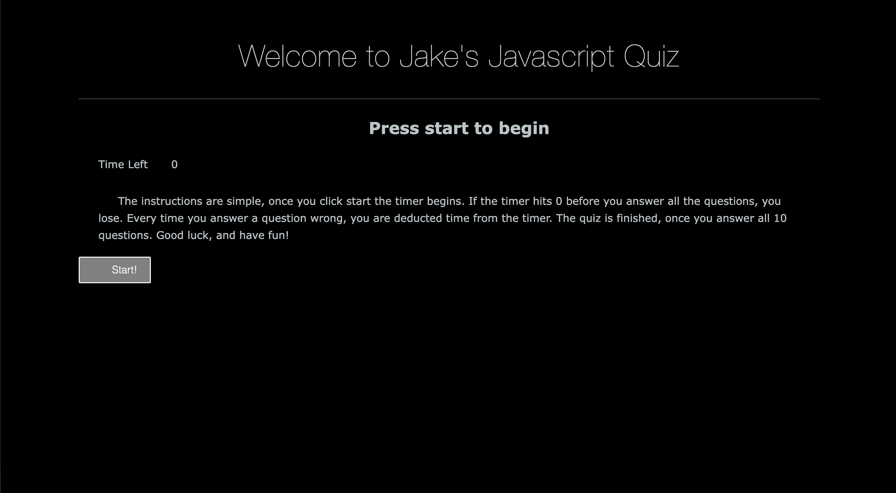

# Multi-choice quiz using Javascript    

## Description

During this project, I wanted to be able to put my Javascript skills to the test. This web app will allow users to take a multiple choice quiz (javascript themed) that was put together by using primarily Javascript. They will be walked through a series of multiple choice questions, able to click the correct or incorrect answer, and finish the quiz. If they get an answer wrong, 5 seconds is deducted from the timer. However many seconds left on the timer, will be the users high score. The user will be able to store their high score by entering in their initials. 

- My motivation for this project was to be able to put some of my Javascript skills into on larger scale project. I wanted to be able to make a fun and interactive way to show off my web api and javascript abilities. 
- I built this project because I wanted to have anyone be able to use an easy to use project that I built. 
- This will be a fun and interactive way to test the users basic Javascript skills. 
- During this project I learned how to be able to impliment different practices into one large function and be practice dom manipulation by having an interactive site. 

## Installation

- In order to see the website live, you can follow this link. https://jvanduyn.github.io/Are-you-smarter-than-a-coder-/

- If you wish to view the code, please visit my Github repository. https://github.com/Jvanduyn/Are-you-smarter-than-a-coder-. 

- If you wish to install the code, you must click on the large green button that displays "Code". From there you will copy this link under the SSH key (git@github.com:Jvanduyn/password-generator.git).

- You will then need to open your operating systems terminal and type "git clone git@github.com:Jvanduyn/password-generator.git". From there you will need to type "cd password-generator". Lastly you will need to type the phrase "code .". You now have access to the repository! Below is a screen shot of the repository as well as the live website. 

## Usage

## Credits

During this project, I collaborated with two people I would like to thank. 

First I collaborated with my fellow classmate Alexander. He and I were able to get most of the project working together minus a few bugs with the password length requirements.

Lastly I was able to work with a tutor of mine Vinnie Lopez. He was able to really help me polish the project off by getting the code working perfectly, and being able to consolidate most of the code to make it functioning properly.

## Features

This project allows a user to generate a password using the requirements the user selects and displays said password into the text box on the website. 

The user will be prompted to start the quiz
- They will be presented with a question, followed by 4 multiple choice answers that act as a button.
- The user will then select their choice, if correct will go to the next question, if wrong, 5 seconds will be deducted from the timer. 
- User will have 50 seconds to finish the quiz. 
- Once finished with all questions, the page will move on to the highscores page and the user can input their initials. 

## Contact
If you wish to contact me, you can reach me at both my email and my github site. 
- jcvanduyn@yahoo.com
- https://github.com/Jvanduyn